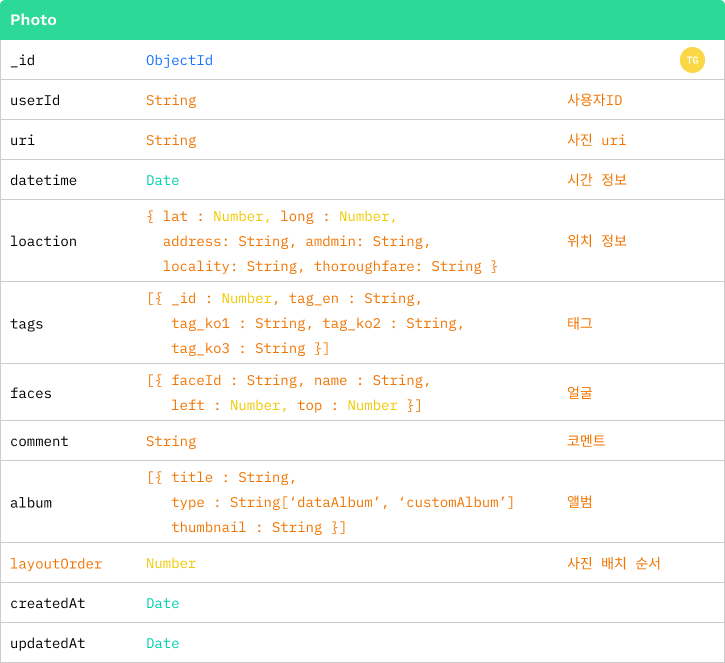

# 나드리: 일상 기록을 위한 사진 정리 안드로이드 앱

 

- [📘 프로젝트 개요](#📘-프로젝트-개요)
- [🛠️ 주요 기술](#️🛠️-주요-기술)
- [📊 ERD](#📊-erd)
- [🏛️ 시스템 아키텍쳐](#🏛️-시스템-아키텍쳐)
- [🎵 나드리 기능 및 화면](#🎵-나드리-기능-및-화면)

 

## 📘 프로젝트 개요

### 🕑 프로젝트 기간
2022. 01 – 2022. 12

 

### 💁 팀원 소개 및 역할
|팀장|팀원|팀원|
|:---:|:---:|:---:|
||||
|[한상준](https://github.com/junhamington)|[김구원](https://github.com/save9109)|[이화경](https://github.com/hwakyung99)|
|**AI** - MLKit 이미지 태그 추출, 얼굴 감지 - AWS Rekognition 얼굴 인식 구현|**클라이언트** - 달력/앨범 인터페이스 - 앨범 생성|**서버** - 서버, DB 설계 및 구현 - 검색,하이라이트, 푸시알림 구현, 통계 기능|

 

### 🏅 배경 및 기대효과
**배경**
- SNS와 블로그의 장점을 차용하여 사진을 통해 일상을 기록하고 정리
- 아날로그 앨범을 이미지 처리 기술 등의 디지털 기술을 사용해 구현
- 기존 앱들의 장점을 녹여낸 "나드리"만의 앨범

**기대효과**
- 사진 정리의 효율성 증가
  - 사진을 통한 일상 기록은 다이어리와 같은 텍스트 형식보다 접근하기 쉬움
  - 이미지 처리 후 태깅을 통해 사진 검색 가능

 

## 🛠️ 주요 기술
**Frontend**

**Backend**

 

## 📊 ERD

 

## 🏛️ 시스템 아키텍쳐

 

## 🎵 나드리 기능 및 화면
### 📍 달력인터페이스

 

### 📍 앨범인터페이스

 

### 📍 얼굴인식

 

### 📍 검색

 

### 📍 하이라이트

 

### 📍 푸시알림

 